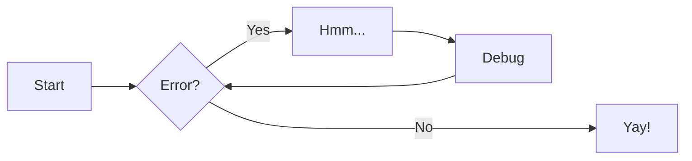

# Use Mermaid for Diagrams

!!! note "Pending Approval"
    Awaiting approval

**Status**: pending
**Date**: 16/05/2025  
**Governance**: Drafted for approval

## Situation - Context and Problem Statement

We require a standardised and maintainable method for embedding diagrams within
our Architecture Decision Records (ADRs). Currently, diagrams are created using
a variety of tools and methods, leading to inconsistencies in style,
difficulties in updating, and challenges with version controlling these visual
assets alongside the textual documentation. This ad-hoc approach hinders the
clarity and long-term maintainability of our architectural documentation.

## Background - Decision Drivers

* **Version Control**: Diagrams should be easily version-controlled alongside
    the ADR markdown files.
* **Developer Experience**: Need for a low-friction method for developers to
    create, view, and update diagrams.
* **Consistency**: Desire for a uniform look and feel for diagrams across all
    records.
* **Accessibility**: Diagrams should be easily viewable by all team members
    without requiring specialised licensed software.
* **Maintainability**: Diagrams should be easy to update as the architecture
    evolves.

## Assessment - Considered Options

* [Mermaid](https://mermaid.js.org/)
* [PlantUML](https://plantuml.com/)
* [draw.io (diagrams.net)](https://app.diagrams.net/)

## Recommendation - Decision Outcome

Chosen Option: **Mermaid**

We will use Mermaid for creating and embedding diagrams in our Architecture
Decision Records.

!!! Info

    To enhance accessibility for screen readers, always include ``accTitle``
    (a short, descriptive title) and ``accDescr`` (a longer description) within
    your Mermaid diagram code blocks.

    This provides context for users who cannot see the visual diagram.

    For more details, see [Mermaid Accessibility - accTitle and accDescr](https://mermaid.js.org/config/accessibility.html#acctitle-and-accdescr-usage-examples).

!!! Tip

    Install the [Markdown Preview Mermaid Support](https://marketplace.visualstudio.com/items?itemName=bierner.markdown-mermaid) VS Code Extension to preview diagrams when editing
    Markdown files in VS Code.

### Justification

Mermaid is chosen due to its excellent integration with Markdown-based
documentation systems like MkDocs, which we use. Its "diagrams as code"
approach allows diagrams to be stored as text, making them inherently
version-controllable alongside the ADR content. The syntax is relatively
simple for common diagram types (flowcharts, sequence diagrams, class diagrams,
state diagrams, etc.), lowering the barrier to entry for team members. This
approach reduces reliance on external tools for creation and viewing, and
helps ensure diagrams are kept up-to-date as they are co-located with the
descriptive text.

### Consequences

* Good, because diagrams can be diffed and version-controlled effectively with Git.
* Good, because it simplifies the toolchain for documentation, as diagrams render directly in our documentation portal.
* Good, because it encourages consistency in diagramming style and notation.
* Good, because lots of tooling exists (e.g. VS Code extensions)
* Bad, because Mermaid's capabilities for very complex diagrams or highly specific styling are limited compared to dedicated GUI tools.
* Bad, because team members will need to learn the Mermaid syntax, which may present an initial learning curve.
* Neutral, because the rendering of complex diagrams might sometimes require careful structuring of the Mermaid code.

### Confirmation

Compliance will be confirmed by:

* Reviewing new and updated ADRs to ensure diagrams are created using Mermaid.
* Ensuring our MkDocs build successfully renders Mermaid diagrams.
* Periodically checking for consistency and clarity of diagrams in the documentation.

## Pros and Cons of the Options

### Mermaid

Mermaid is a Javascript-based diagramming and charting tool that renders
Markdown-inspired text definitions to create and modify diagrams dynamically.

* Good, because it's text-based, enabling "diagrams as code" and straightforward version control.
* Good, because it integrates seamlessly with Markdown and is widely supported (e.g., GitHub, GitLab, MkDocs via plugins).
* Good, because it has a relatively simple and intuitive syntax for common diagram types.
* Good, because diagrams render directly in browsers or Markdown previews, often without needing separate tools for viewing.
* Good, because it encourages diagrams to be updated along with the documentation text.
* Bad, because it offers limited layout control and customization compared to GUI tools or PlantUML.
* Bad, because it may not support very complex or niche diagram types as comprehensively as other tools.
* Bad, because extremely complex diagrams can become difficult to write and maintain in text.

### PlantUML

PlantUML is an open-source tool that uses a simple textual description language
to create UML diagrams and a variety of other software development-related
diagrams.

* Good, because it's text-based ("diagrams as code"), excellent for version control.
* Good, because it supports a very wide range of UML diagrams and many other diagram types.
* Good, because it offers more powerful layout algorithms and styling options compared to Mermaid.
* Good, because it has a large, active community and extensive documentation.
* Bad, because its syntax can be more verbose and complex than Mermaid's, especially for simpler diagrams.
* Bad, because rendering often requires a local Java installation and generation step, or a dedicated server, although IDE integrations exist.
* Bad, because integration into Markdown-centric static site generators like MkDocs can be more involved (e.g., requiring specific plugins and potentially a Java runtime on the build server).

### draw.io (diagrams.net)

draw.io (now diagrams.net) is a free, open-source, web-based and desktop diagramming application.

* Good, because it's a powerful and flexible GUI-based diagramming tool with a drag-and-drop interface.
* Good, because it supports a vast array of diagram types, shapes, and customization options.
* Good, because it has a user-friendly interface, making it accessible for users who prefer visual tools.
* Good, because it can export to various formats (PNG, SVG, PDF, XML) and allows embedding diagrams in web pages.
* Bad, because diagrams are typically stored as binary files (e.g., `.drawio` which is XML but not easily human-readable for diffs, or image files like `.png`, `.svg`) which are difficult to diff and merge meaningfully in version control.
* Bad, because updating diagrams often involves a manual export/import cycle, making it less integrated with the "docs as code" workflow.
* Bad, because it can lead to inconsistencies in style and formatting across different diagrams and authors if not strictly managed with templates.
* Neutral, because while `.drawio` files are XML, their diffs are generally not helpful for understanding visual changes.

## Example

See [Material for MkDocs Diagram support](https://squidfunk.github.io/mkdocs-material/reference/diagrams/)

Below is an example flowchart diagram embedded in this record:

