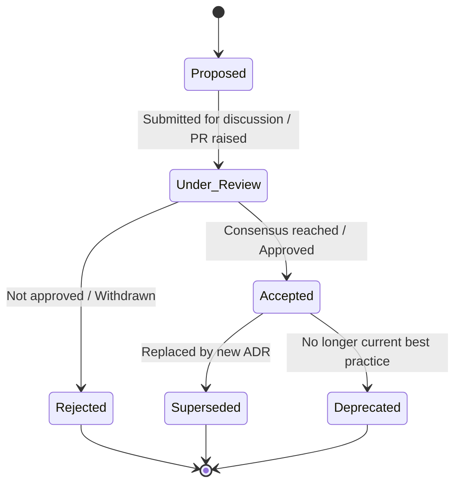

# Architecture Decision Record Process

!!! success "Approved"

    This process was approved by the DHCW Technical Design Authority (TDA) on
    13/06/2025

## Introduction

This document outlines the process for proposing, developing, collaborating
on, and approving Architecture Decision Records (ADRs) within DHCW. The
process emphasises collaboration and working in the open whilst minimising
the involvement of formal governance bodies (e.g. Technical Design Authority
(TDA) and Technical Design Assurance Group (TDAG)) as much as is practicable
whilst maintaining suitable levels of assurance and governance.

Anyone can propose an ADR and request collaboration to approve a decision.
The proposal should clearly articulate the problem and context, and may
include a solution or decision if ready. Early engagement is strongly
encouraged, so it is expected proposals will be incomplete and very draft
when first proposed.

There are multiple levels of decision defined, which follow different
processes proportionate to their impact/significance.

!!! success "Template"

    The approved [ADR template](../architecture-decision-record-template.md)
    should be used to ensure consistency and completeness.

## When to Create an ADR

An ADR should be created for decisions that have a significant impact on the
architecture of a system or the technical landscape of DHCW. The primary
purpose is to capture the context and rationale behind important decisions
for future reference and understanding.

Generally, an ADR is justified when a decision:

* Affects the structure of a system or multiple systems.
* Requires coordination or consistency across different teams or projects.
* Impacts the long-term maintainability, scalability, security, or performance
    of a system or service.
* Changes external interfaces or significant internal APIs.
* Would benefit future developers, architects, or stakeholders to understand
    the "why" behind the decision.

While the above guidelines cover many scenarios, an ADR is typically **not**
required for:

* Decisions that do not fall into the category of "Architecture" (e.g.,
    purely project management, administrative, or minor UI design choices).
* Trivial or routine activities with no lasting architectural impact.
* Decisions fully covered by existing, well-documented standards, policies,
    or established patterns.
* Temporary workarounds, short-lived experiments, or proofs of concept
    that are not intended to be permanent architectural components.
* Low-risk, self-contained decisions made by a single developer within a
    project with no impact outside that immediate scope.

## Initiation and Commissioning

Prior to the creation of an ADR it is recommended that an [Issue](https://github.com/GIGCymru/architecture/issues)
is raised in this GitHub repository outlining the need for a new ADR (or
update to an existing one). This enables very early discussion around the
potential ADR with minimal outlay and effort.

Once the proposer wants to move forward with creating/updating an ADR, they are
encouraged to use the standard Git/GitHub workflow and raise a Pull Request
(PR) ahead of following the decision making process documented here.

??? Tip "Example Git Workflow"

    * Clone this repository: `git clone git@github.com:GIGCymru/architecture.git`
    * Create a branch from `main` to work on (see [Naming Conventions](../../../decisions/meta-decisions/architecture-decision-records-naming-conventions/index.md)):
      `git checkout main`, `git checkout -b adr-for-x`
    * Make the required changes (add/update files) in your editor of choice.
      (note [the template](../architecture-decision-record-template.md))
    * Commit the changes: `git add changed-file.md`, `git commit -m "Added new ADR for x"`
    * Push the changes to GitHub `git push -u origin HEAD`
    * Raise a [Pull Request](https://github.com/GIGCymru/architecture/pulls) on GitHub.com

Notwithstanding the above guidance, the Technical Design Authority (TDA),
Technical Design Assurance Group (TDAG), or other relevant governance bodies
may commission the creation or update of an ADR in specific areas as needed.

## Lifecycle and Status

Each ADR progresses through a lifecycle, and its current state is tracked using
a defined status. This ensures clarity, traceability, and helps manage the
relevance of decisions over time. The `Status` field in the ADR template must
be updated to reflect the current state of the ADR.

The defined statuses are:

* **Proposed**: The initial state of an ADR. It has been drafted and is
    ready for discussion and review.
* **Under Review**: The ADR is actively being discussed and reviewed by
    stakeholders (e.g. via a Pull Request for Level 1, or by a Temporary
    Decision Group for Level 2+). This status indicates the ADR has moved
    past the initial `Proposed` state and is undergoing evaluation before a
    decision is reached.
* **Accepted**: The ADR has been approved by the relevant decision-making
    process (e.g., consensus on a PR, TDG agreement). The decision
    documented is now considered active and should be followed.
* **Rejected**: The proposed decision was reviewed but not approved. The ADR
    is kept for the record of the discussion and outcome.
* **Superseded**: An `Accepted` ADR that has been replaced by a newer ADR.
    The ADR should clearly indicate which ADR supersedes it.
* **Deprecated**: An `Accepted` ADR that is no longer considered relevant or
    best practice. It might be phased out or archived but is not directly
    replaced by a specific new ADR.

The following diagram illustrates the typical lifecycle flow of an ADR:

## Quality and Approval Criteria

For an ADR to be considered "good enough" for approval and merging, it should
meet a set of quality criteria. These criteria ensure that the decision is
well-understood, justified, and provides sufficient context for future
reference.

The following checklist should be considered during the review of an ADR:

* **Clear Problem Articulation:** Is the problem statement, context, and the
  driving factors behind the need for a decision clearly and concisely
  described? (See the **Summary** and **Drivers** sections in the ADR template)
* **Exploration of Alternatives:** Have sufficient and relevant alternative
  solutions been considered and documented? (See the **Options** section.)
* **Documented Rationale and Trade-offs:** Is the chosen solution clearly
  stated, and is the rationale behind the decision well-justified? Are the
  trade-offs (pros, cons, consequences) of the chosen solution and key
  alternatives explicitly documented? (See the **Options Analysis** and
  **Recommendation** sections.)
* **Stakeholder Engagement:** Has feedback from relevant stakeholders been
  sought and incorporated, or is there a rationale if not?
* **Sufficient Context and Linkages:** Does the ADR include necessary
  background information, references to related ADRs, issues (e.g., GitHub
  issues), or other relevant documentation?
* **Completeness and Clarity:** Is the ADR well-written, easy to understand,
  and does it adhere to the [latest ADR template](../architecture-decision-record-template.md)?

It is the responsibility of the ADR proposer to strive to meet these criteria.
During the review process (whether via a Pull Request for Level 1 decisions or
within a Temporary Decision Group for higher levels), reviewers and TDG members
are expected to assess the ADR against these quality criteria before
recommending or granting approval.

## Temporary Decision Groups (TDG)

Depending on the level of decision, it may require the formation of a Temporary
Decision Group (TDG). This is a group of volunteers that will ideally have
relevant expertise/experience in the topic area but also may just have an
interest and desire to be involved in the ADR.

When a TDG is utilised, any decision reached by the group is automatically
accepted by the relevant assurance and governance committee.

### Operations and Decision Making

Temporary Decision Groups (TDGs) are formed to collaboratively review and
decide on ADRs, particularly for Level 2 and above. While open to interested
volunteers, ensuring the group possesses the necessary domain expertise is
crucial, especially for higher-level decisions (Level 3 and 4). The proposer
(for Level 2/3) or the TDA (for Level 4) should actively seek participation
from individuals with relevant knowledge and experience when forming the TDG.
The governance body commissioning or reviewing the TDG composition is
responsible for ensuring adequate expertise is represented.

The primary goal of a TDG is to reach **consensus** on the proposed decision.
Consensus means that all members can live with the decision, even if it
wasn't their first choice, and support its implementation. Unanimous
agreement is ideal but not always required; the aim is to avoid significant
unresolved objections.

Disagreements are expected and are a valuable part of the process. TDG
members should engage in open discussion, present evidence, and explore
alternatives to resolve conflicts. If consensus proves difficult to achieve
after thorough discussion and exploration, the TDG should document the
differing viewpoints and the reasons for the disagreement within the ADR.

If a TDG is unable to reach a decision or resolve significant disagreements
within the agreed timeframe, the matter should be **escalated**.

* For Level 2 and 3 decisions, the escalation path is back to the
    **Technical Design Assurance Group (TDAG)**. The TDG presents the
    unresolved issues and differing viewpoints to the TDAG for guidance or
    a final decision.
* For Level 4 decisions, the escalation path is back to the **Technical
    Design Authority (TDA)**, which commissioned the TDG.

## Decision Levels

To ensure the ADR process is proportionate to the impact and scope of a
decision, decisions are categorised into four levels:

!!! Note

    When determining the level, consider also how **easily reversible** the
    decision is (can it be easily stopped, omitted, or undone?) and how
    **easily isolatable** it is (can it run in parallel with similar decisions
    without interference?). Decisions that are hard to reverse and/or hard to
    isolate typically warrant a higher level due to increased risk and
    commitment.

### Level 1: Project-Specific Decisions

* **Scope:** Primarily impacts a single project or a small, closely related
  set of components within a project.
* **Impact:** Minimal impact outside the immediate project team.
* **Characteristics:** Often **easily reversible** and **easily isolatable**.
  The commitment is typically low, allowing for quick trials and adjustments.
* **Examples:** Choice of a specific library within a project, minor
  refactoring decisions, specific implementation details that don't affect
  external interfaces or broader architectural patterns.

### Level 2: Cross-Project/Team Decisions

* **Scope:** Impacts multiple projects or teams, but not necessarily the entire
  organisation.
* **Impact:** Requires coordination or consistency across several teams or
  projects.
* **Characteristics:** May have varying degrees of reversibility and
  isolatability. While potentially more complex to undo or run in parallel
  than Level 1, they are generally less entangled than higher-level decisions.
* **Examples:** Standardising a specific tool or framework used by several
  teams, decisions affecting shared services used by a subset of projects,
  changes to internal APIs consumed by multiple teams.

### Level 3: Organisation-Wide Decisions

* **Scope:** Impacts all projects, teams, or the entire organisation's technical
  landscape.
* **Impact:** Requires broad consensus or mandates organisation-wide
  standards or practices.
* **Characteristics:** Tend to be **harder to reverse** due to broad adoption
  and significant impact if changed. They may also be **harder to isolate**
  as they often establish organisation-wide standards or affect shared
  infrastructure.
* **Examples:** Mandated programming languages, standard architectural
  patterns for all new services, organisation-wide security policies
  affecting technical implementation.

### Level 4: Major/Significant Decisions

* **Scope:** Decisions with significant strategic, technical, or national-
  level implications.
* **Impact:** High risk, high cost, or significant external visibility/
  dependency. May involve external stakeholders or national standards.
* **Characteristics:** Typically **hard to reverse** and **hard to isolate**,
  involving substantial commitment (e.g., financial, training, integration
  effort). These demand the most rigorous review and careful consideration.
* **Examples:** Adoption of a major new cloud platform, significant changes
  to core infrastructure, decisions impacting national data standards or
  interoperability.

## Process by Level

The process for reviewing and finalising an ADR varies by its defined level:

### Level 1: Project-Specific Decisions Process

* **Review Timeframe:** A fixed review timeframe (default **one** week) is set
  for the PR by the proposer and specified in the PRs description.
* **Feedback:** Team members and other relevant peers provide feedback via the
  PR.
* **Approval:** The ADR is merged upon reaching consensus or at the end of the
  review period if no major objections are raised.
* **Notification:** All Level 1 ADRs merged since the last Technical Design
  Assurance Group (TDAG) meeting are added as 'below the line' submissions to
  the TDAG agenda for information.

### Level 2: Cross-Project/Team Decisions Process

* **Flagging:** The proposer flags the ADR to the Technical Design
  Assurance Group (TDAG) agenda as a Level 2 decision.
* **TDG Formation:** The proposer explains the ADR at the TDAG and requests
  volunteers to form a TDG. The TDG must include at least **two** reviewers,
  in addition to the proposer.
* **Review Timeframe:** The proposer, in consultation with the TDG, sets a
  timeframe for discussion and review (default: **two** weeks).
* **Decision:** The TDG collaborates on the ADR and collectively makes the
  decision.
* **Notification:** The finalised ADR and its decision are added to the next
  TDAG agenda for information only.

### Level 3: Organisation-Wide Decisions Process

Level 3 decisions follow the same process as Level 2, but require **five**
members (including the proposer) to form the TDG. In addition to submitting
the agreed decision to TDAG for information, it is also submitted to the
Technical Design Authority (TDA) agenda (below the line) for information
only.

### Level 4: Major/Significant Decisions Process

Level 4 decisions follow the same process as Level 3 but the flagging and
formation of the TDG is handled directly by TDA, bypassing TDAG, although the
outcomes of decisions are shared with TDAG for information.

## Roles and Responsibilities

Clear roles and responsibilities are essential for the effective functioning
of the ADR process. The following outlines key roles and their involvement:

### Stewardship and Maintenance

The overall "stewarding" or "librarianship" of the ADRs, including the
repository, process documentation, template, and ensuring consistency, falls
under the remit of the **ADR Steward**. This role is expected to be a function
within or designated by the Technical Design Assurance Group (TDAG) and/or
Technical Design Authority (TDA).

Once an ADR is **Accepted**:

* The decision it documents becomes a collective agreement.
* The **ADR Proposer** is typically the initial main author.
* Ongoing maintenance, such as identifying when an ADR might be outdated,
    superseded, or deprecated, is a collective responsibility of the
    architectural community.
* The **ADR Steward**, along with TDAG/TDA, will oversee the health of the
    ADR log and may prompt reviews or updates as needed. Proposers of new,
    related ADRs should also identify existing ADRs that may need to be
    superseded.

### Key Roles

| Role                 | Responsibility           |
| :------------------- | :----------------------- |
| **ADR Proposer**     | Initiates an ADR, leads its development by drafting content and incorporating feedback. Presents the ADR to the relevant review body (e.g., via Pull Request, or to a TDG/TDAG/TDA). Responsible for ensuring the ADR meets quality criteria. |
| **TDG Chair**        | (Often the ADR Proposer, or designated for Level 4 TDGs) Facilitates TDG discussions, ensures fair participation, helps track progress towards a decision, and may assist in summarizing the TDG's outcome and updating the ADR. |
| **TDG Members**      | Actively participate in the evaluation, review, and decision-making for Level 2, 3, and 4 ADRs. Contribute expertise, challenge assumptions constructively, and help the TDG reach consensus on the decision. |
| **TDAG**             | Facilitates TDG formation for Level 2 & 3 ADRs. Acts as an escalation point for unresolved disagreements in Level 2 & 3 TDGs. Reviews outcomes of Level 1, 2 & 3 ADRs for information and process adherence. Can commission ADRs. Approves requests for private ADRs (Level 2 & 3). Oversees the ADR process and supports the ADR Steward function. |
| **TDA**              | Commissions and facilitates TDG formation for Level 4 ADRs. Acts as an escalation point for unresolved disagreements in Level 4 TDGs. Reviews outcomes of Level 3 & 4 ADRs for information. Can commission ADRs. Approves requests for private ADRs (Level 4). Provides ultimate governance oversight for the ADR process and supports the ADR Steward function. |
| **ADR Steward**      | (A function likely performed by TDAG/TDA secretariat or a designated individual/team) Owns the ADR repository structure and process documentation. Ensures ADR template compliance, consistency across ADRs, and manages the lifecycle metadata (e.g., status updates in the log). Assists in reporting on ADR activity. |

### Stages, Activities and Owners

| Stage                              | Activities                 | Owner(s)  |
|:-----------------------------------|:---------------------------|:----------|
| **1. Pre-ADR Discussion**          | Raise a GitHub Issue describing the problem or opportunity. | ADR Proposer |
| **2. Drafting the ADR**            | Use template, outline problem, context, options. | ADR Proposer |
| **3. Assigning a Decision Level**  | Determine decision level (1-4) based on scope/impact. | ADR Proposer (reviewed by ADR Steward or TDAG) |
| **4. Pull Request Creation**       | Submit ADR draft as PR in the GitHub repo. | ADR Proposer |
| **5. TDG Formation** (if Level ≥2) | Identify and confirm volunteers, define TDG scope. | ADR Proposer, with TDAG or TDA for Level 3/4 |
| **6. Review & Collaboration**      | Drive reviews, manage discussion, gather feedback. | TDG Chair (or Proposer for Level 1) |
| **7. Decision Making**             | Reach consensus, capture rationale, finalise ADR. | TDG (Chair facilitates), ADR Proposer |
| **8. Approval & Merge**            | Merge PR, assign status (e.g. Approved), label by level | ADR Proposer |
| **9. Communication** | Add to TDAG/TDA agenda as needed, broadcast key decisions. | TDAG & TDA Coordinators |
| **10. Lifecycle Management**       | Monitor for relevance, deprecate outdated ADRs. | ADR Steward |

### Approval Authority

The primary role of TDAG and TDA in the context of ADRs that have been through
a Temporary Decision Group (TDG) is one of oversight, process assurance, and
handling escalations, rather than a direct re-approval or veto of a TDG's
consensus decision.

As stated in the "Temporary Decision Groups (TDG)" section, "When a TDG
is utilised, any decision reached by the group is automatically accepted
by the relevant assurance and governance committee."

**TDAG/TDA members** participate in TDGs relevant to their expertise,
contributing to the consensus directly within that forum. Their "approval"
authority is exercised through:

* Commissioning ADRs.
* Defining the scope and level of ADRs.
* Facilitating and ensuring the proper constitution of TDGs (especially
        for Level 3 and 4).
* Acting as the escalation point if a TDG cannot reach consensus.
* Governing the overall ADR process itself.
* Approving exceptions, such as the private ADR process.
* For Level 1 ADRs (which do not use a TDG), the approval is by peer
    consensus on the Pull Request, with TDAG reviewing for information.

## Compliance & Enforcement

Beyond the ADR approval process, TDA and TDAG also play a key role in upholding
the decisions documented in `Accepted` ADRs. Architectural designs and
proposals submitted to TDA/TDAG for review are expected to align with these
decisions.

The ADR template includes a `Confirmation` section for proposers to articulate
this alignment, justify any deviations, and to propose specific methods for
confirming ongoing compliance with the decision.

TDA and TDAG have the authority to challenge or reject submissions that do not
adequately comply with, or justify deviations from, `Accepted` ADRs, thereby
ensuring architectural consistency and adherence to accepted decisions.

Teams need to be proactive in consulting the ADRs and using them as a living
knowledge base of architectural decisions to inform designs and approaches.

## Handling Sensitive or Secure ADRs

The default is to collaborate on ADRs via the DHCW public GitHub repository,
in the open.

While ADRs are public by default to promote transparency, there are exceptional
circumstances where the subject matter is highly sensitive (e.g., involving
security vulnerabilities, confidential commercial information, or critical
infrastructure details that should not be broadly disclosed).

### Requesting a Private ADR Process

If a proposed ADR topic is believed to be highly sensitive:

1. The proposer must formally request an exception for private discussion
    and restricted documentation from the **Technical Design Authority (TDA)**
    or the **Technical Design Assurance Group (TDAG)** (depending on the
    level of decision). This request should be made through appropriate internal
    channels and should outline the nature of the sensitivity and why a private
    process is necessary.
2. The TDA/TDAG will review the request. Approval for a private process will
    be granted if the justification for sensitivity is deemed valid.

### Private Discussion and Documentation

If approved for a private process:

* Discussions will occur in a restricted forum, as determined and facilitated
    by the TDA/TDAG (e.g., a private channel, dedicated secure meetings).
* An ADR will still be created using the standard template and will follow the
    standard lifecycle (e.g., Proposed, Accepted).
* However, the ADR itself, containing sensitive details, will be stored in a
    secure, access-controlled location designated by the TDA/TDAG, rather
    than the public repository.

### Transparency of Outcome for Private ADRs

To maintain a degree of transparency and traceability while protecting
sensitive information a placeholder or summary ADR **may** be created in the
public repository.

This public-facing ADR would typically:

* Indicate that a decision on a sensitive topic has been made and recorded.
* State the ADR title (if the title itself is not sensitive).
* Provide a high-level, non-sensitive summary of the decision's scope or
    impact, if possible and appropriate.
* Clearly state that the full details are restricted and stored in a
    secure location due to sensitivity, referencing the approval from
    TDA/TDAG.
* Link to the original generic public issue if one was created.
* The decision on whether to create a public placeholder/summary, and the
    level of detail it contains, will be made by the TDA/TDAG, in
    consultation with relevant security and information governance stakeholders.
* The existence of the decision and its status (e.g., Accepted) should still
    be traceable through appropriate governance channels (TDA/TDAG records),
    even if the full content is not publicly accessible.

## General Approach

The TDG (or the original proposer, for less complex ADRs) will conduct
thorough research, analysis, and evaluation of potential solutions or
options. This may involve:

* Gathering additional information and requirements.
* Evaluating different architectural patterns or technologies.
* Assessing the potential risks and benefits of each option.
* Developing prototypes or proof-of-concepts, if necessary.

Throughout the development process, the TDG (or proposer) should actively
seek feedback from relevant stakeholders, including other architects,
developers, operations engineers, and business representatives. This feedback
should be incorporated into the ADR document.

## Appendix - ADR Creation Workflow

The following diagram illustrates the typical end-to-end process for creating
and approving an ADR, from initial idea to a recorded decision.

```mermaid
graph TD
    accTitle: ADR Workflow
    accDescr: Flowchart showing the typical steps for proposing, developing, and deciding on an Architecture Decision Record.

    Start(["Start: Identify need for a new or updated ADR"]) --> Raise_GitHub_Issue("Optional: Raise GitHub Issue for Early Discussion");
    Raise_GitHub_Issue          --> Is_Sensitive{"Is ADR content expected to be **sensitive**?"};

    %% Private or Public ADR
    Is_Sensitive        -- Yes  --> Request_Private["Request private process from TDAG (Level 1-3) or TDA (Level 4)"];
    Is_Sensitive        -- No   --> Process_Publicly;

    Request_Private             --> Private_Approval{"Private Process Approved?"};
    Private_Approval    -- Yes  --> Process_Privately["ADR Handled **Privately**: Secure discussion & storage. **Optional** public placeholder on GitHub."];
    Private_Approval    -- No   --> Process_Publicly["ADR Handled **Publicly**: Open discussion, public storage via GitHub & Pull Request process"];
    Process_Privately           --> TDG_Decision{"Decision Level?"};
    Process_Publicly            --> TDG_Decision;

    %% Level 1 Process
    TDG_Decision        -- 'Level 1'    --> Peer_Review_ADR["Proposer requests ADR Peer Review (default: 1 week)"];
    Peer_Review_ADR     --> TDG_Consensus_Q

    %% Level 2 - 4 Process
    TDG_Decision        -- 'Level >= 2' --> Flag_TDAG_TDA["Flag to TDAG (Level 2 & 3) or TDA (Level 4)"];

    Flag_TDAG_TDA --> TDG_Formed["TDG Formed (Proposer + members, size / composition varies by level)"];

    TDG_Formed --> TDG_Collaboration["TDG Collaborates, Reviews & Seeks Consensus (default: 2 weeks)"];

    TDG_Collaboration --> TDG_Consensus_Q{"General Consensus on ADR?"};
    TDG_Consensus_Q -- Yes --> Accept_Reject_ADR;
    TDG_Consensus_Q -- No --> Escalate["Escalate to TDAG (Level 1 - 3) or TDA (Level 4) for Resolution"];
    Escalate --> TDAG_TDA_Decides["TDAG/TDA Makes Final Decision"];
    TDAG_TDA_Decides --> Accept_Reject_ADR;

    %% Finalise ADR
    Accept_Reject_ADR["Update ADR Status (e.g., 'Accepted', 'Rejected') & Merge Pull Request"] --> Notify_Governance["Notify TDAG (Level 1-3) and TDA (Level 4)"];
    Notify_Governance --> End(["End"]);
```

